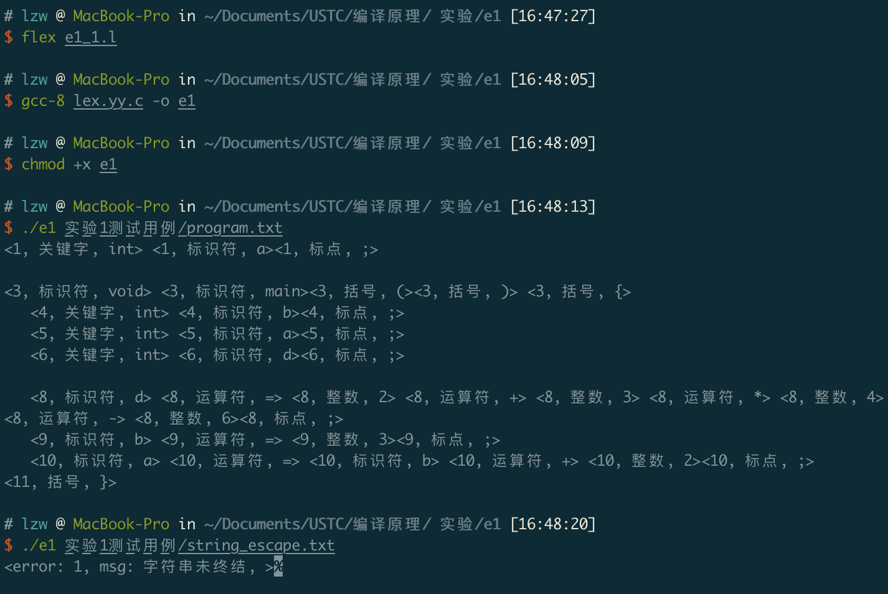
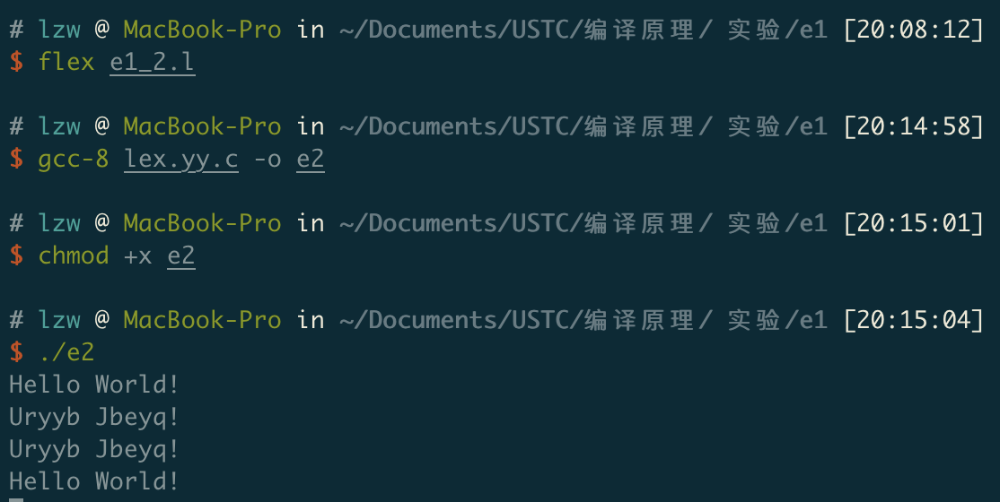

# 实验一


## 词法分析  (不限语言；不限方法)

本实验目的是加深对词法分析过程的理解，掌握词法分析的方法，使用任何编程语言或者词法分析工具进行词法分析。

分析的语言可以自定义，也可以选择实现现有语言的文法分析。

对于输入的源程序，识别出关键字、标识符、常量（数字，字符串）、运算符、界符、注释（单行和多行注释）。并输出所识别词法单元的编码和单词符号。

具有一定的错误分析能力。

要求代码中能体现关键字、各个不同词法单元的构造规则，或者能结合代码进行解释。

 答案如下：

1. Flex代码如下所示。

   ```c
   %{
   	#include <stdlib.h>
   	#include <stdio.h>
   	FILE* f;
   	int i;
   	int comment_flag;
       int string_flag;
   	int comment_begin;
       int string_begin;
       void printToken(int line,char* type,char* text);
       void printError(int line,char* msg,char* text);
   %}
   /* 记录行号 */
   %option yylineno
   
   /*常量*/
   INT 0|[1-9][0-9]*
   INT_HEX 0[xX][a-fA-F0-9]+
   INT_OCT 0[1-7][0-7]*
   INT_BIN 0[bB][01]+
   FLOAT {INT}\.[0-9]+
   SCIENCE (([0-9]+\.[0-9]*)|([0-9]*\.[0-9]+)|INT)[Ee][-+]?[0-9]+
   INTEGER {INT_HEX}|{INT}|{INT_OCT}|{INT_BIN}
   DOUBLE {SCIENCE}|{FLOAT}
   STRING \"[^\"\n]*\"
   STRING_BEGIN \"
   
   /*标识符*/
   ID [a-z_A-Z][a-z_A-Z0-9]*
   /*关键字*/
   STRUCT struct
   RETURN return
   IF if
   ELSE else
   WHILE while
   TYPE int|float
   
   /*运算符*/
   COMMA ,
   ASSIGNOP  =
   PLUS  \+
   MINUS \-
   STAR  \*
   DIV   \/
   AND   &&
   DOT   \.
   NOT   \!
   /* 界符 */
   SEMI  ;
   LP    \(
   RP    \)
   LB    \[
   RB    \]
   LC    \{
   RC    \}
   SPACE [ \f\n\r\t\v]+
   
   /*注释*/
   COMMENT ("//".*)|("/*"([*]*(([^*/])+([/])*)*)*"*/")
   COMMENT_BEGIN "/*"
   
   /*错误*/
   AERROR .
   INT_HEX_ERROR 0[xX][a-fA-F0-9]*[g-zG-Z]+[a-fA-F0-9]*
   INT_OCT_ERROR 0[0-7]*[89]+[0-7]*
   INT_BIN_ERROR 0[bB][01]*[2-9]+[01]*
   STRING_END_ERROR \"[^\"\n]*$
   
   %%
    /*跳过空白和注释*/
   {SPACE}             { ECHO; }
   {COMMENT}           { printToken(yylineno,"注释",yytext);}
   {COMMENT_BEGIN} {
   	comment_flag = 1;
   	comment_begin = yylineno;}
   {STRING_BEGIN} {
   	string_flag = 1;
   	string_begin = yylineno;}
    /*未终结错误*/
   <<EOF>> {
   	if(comment_flag == 1){
           printError(comment_begin, "注释未终结","");
   		comment_flag = 0;}
       if(string_flag == 1){
           printError(string_begin, "字符未终结","");
           string_flag = 0;
       }
   	yyterminate();
   }
    /*关键字*/
   {TYPE}              |
   {STRUCT}            |
   {RETURN}            |
   {IF}                |
   {ELSE}              |
   {WHILE}             { printToken(yylineno,"关键字",yytext);}
    /*数字类型错误*/
   {INT_HEX_ERROR}     {if(comment_flag!=1) printError(yylineno, "十六进制数错误",yytext);}
   {INT_OCT_ERROR}     {if(comment_flag!=1) printError(yylineno, "八进制数错误",yytext);}
   {INT_BIN_ERROR}     {if(comment_flag!=1) printError(yylineno, "二进制数错误",yytext);}
    /*常量表示*/
   {INTEGER}            {if(comment_flag!=1)  printToken(yylineno,"整数",yytext);}
   {DOUBLE}            {if(comment_flag!=1)  printToken(yylineno,"浮点数",yytext);}
   {STRING}            {
                           if(yytext[yyleng-2]=='\\'){
                               yyless(yyleng-1);
                               yymore();
                           }
                           else{
                               printToken(yylineno,"字符串",yytext);
                           }
                       }
   {STRING_END_ERROR}  { printError(yylineno,"未终结字符串",yytext); }
    /*标点*/
   {SEMI}              |
   {COMMA}             {if(comment_flag!=1)  printToken(yylineno,"标点",yytext);}
    /*运算符*/
   {ASSIGNOP}          |
   {PLUS}              |
   {MINUS}             |
   {STAR}              |
   {DIV}               |
   {AND}               |
   {DOT}               |
   {NOT}               {if(comment_flag!=1)  printToken(yylineno,"运算符",yytext);}
    /*括号*/
   {LP}                |
   {RP}                |
   {LB}                |
   {RB}                |
   {LC}                |
   {RC}                {if(comment_flag!=1)  printToken(yylineno,"括号",yytext);}
    /*标识符*/
   {ID}                {if(comment_flag!=1)  printToken(yylineno,"标识符",yytext);}
   {AERROR}            {if(comment_flag!=1) printError(yylineno, "错误字符",yytext);}
   %%
   
   int main(int argc,char** argv){
   	if(argc<2){
   		yylex();
   		return 0;
   	}
   	for(i=1;i<argc;i++){
   		f=fopen(argv[i],"r");
   		if(!f){
   			perror(argv[i]);
   			return 1;
   		}
   		comment_flag = 0;
           yyrestart(f);
           yylex();
           fclose(f);
   	}
   	return 0;
   }
   
   void printToken(int line,char* type,char* text){
       printf("<%d, %s, %s>",line,type,text);
   }
   
   void printError(int line,char* msg,char* text){
       printf("<error: %d, msg: %s, %s>",line,msg,text);
   }
   
   int yywrap() {
       return 1;
   }
   
   ```

   

2. 解释如下

   1. 声明了关键字、标识符、常量( 整型、浮点数和字符串)、运算符、界符、注释等正则表达式

      ```c
      /*常量(整型、浮点数和字符串)*/
      INT 0|[1-9][0-9]*
      INT_HEX 0[xX][a-fA-F0-9]+
      INT_OCT 0[1-7][0-7]*
      INT_BIN 0[bB][01]+
      FLOAT {INT}\.[0-9]+
      SCIENCE (([0-9]+\.[0-9]*)|([0-9]*\.[0-9]+)|INT)[Ee][-+]?[0-9]+
      INTEGER {INT_HEX}|{INT}|{INT_OCT}|{INT_BIN}
      DOUBLE {SCIENCE}|{FLOAT}
      STRING \"[^\"\n]*\"
      STRING_BEGIN \"
      /*标识符*/
      ID [a-z_A-Z][a-z_A-Z0-9]*
      /*关键字*/
      STRUCT struct
      RETURN return
      IF if
      ELSE else
      WHILE while
      TYPE int|float
      /*运算符*/
      COMMA ,
      ASSIGNOP  =
      PLUS  \+
      MINUS \-
      STAR  \*
      DIV   \/
      AND   &&
      DOT   \.
      NOT   \!
      /* 界符 */
      SEMI  ;
      LP    \(
      RP    \)
      LB    \[
      RB    \]
      LC    \{
      RC    \}
      SPACE [ \f\n\r\t\v]+
      /*注释*/
      COMMENT ("//".*)|("/*"([*]*(([^*/])+([/])*)*)*"*/")
      COMMENT_BEGIN "/*"
      ```

      

   2. 对于未终结注释和未终结字符串有错误提示, 当文件结束而注释和字符串没有结束时也提示错误

      ```c
      <<EOF>> {
      	if(comment_flag == 1){
              printError(comment_begin, "注释未终结","");
      		comment_flag = 0;}
          if(string_flag == 1){
              printError(string_begin, "字符未终结","");
              string_flag = 0;
          }
      	yyterminate();
      }
      ```

   3. 以三元式形式输出

3. 运行结果如下图所示。

   

##  Lex 练习

接受a-z或A-Z中的任何字符（串）的输入，并在字母表中向前移动13个位置，如果到z，则回绕到a。

例如：

```
   Hello World!
   Uryyb Jbeyq!
```

相对应的，因为移动13，所以，输入Uryyb Jbeyq!会输出Hello World！

答案如下：

1. Flex代码如下所示。

   ```c
   %%
   [A-Za-z]        {
                       if(yytext[0]<=90){
                           printf("%c",(yytext[0]+13-65)%26+65);
                       }else{
                           printf("%c",(yytext[0]+13-97)%26+97);
                       }
                   }
   #           return 0;
   .           ECHO;  
   %%
   
   int main(int argc, char* argv[]) {
       yylex();
       return 0;
   }
   
   int yywrap() {
       return 1;
   }
   ```

2. 其中`(yytext[0]+13-65)%26`获得在字母表中的相对位置，`+65`是将字母表中的位置换算成ASCii码。

3. 运行结果如下图所示。

   

