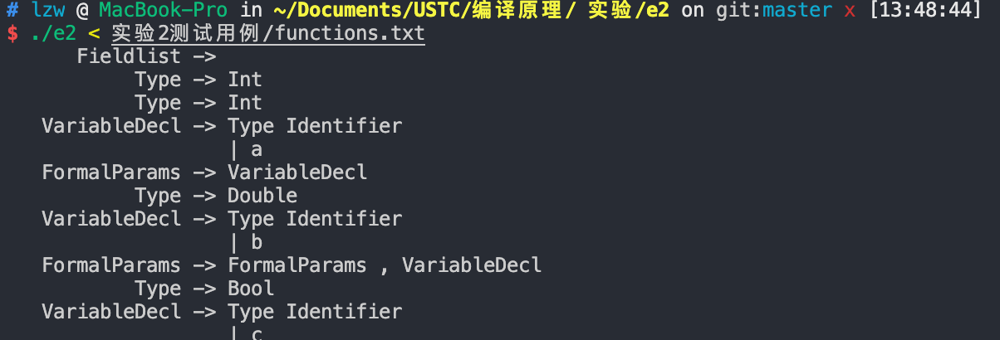

# Bison


## 实验目的

本次实验主要进行语法分析。推荐使用bison。通过本实验，可以了解语言的设计和分析，熟悉bison的使用，为代码生成做准备。


## 实验要求

下面是实验二必须解析的语法结构（包括但不限于）：
1.变量：包括各种类型，如基础数据类型（int，float, char）、指针、数组、结构体和对象；

2. 函数，包括参数和返回值
3. 表达式：算术和布尔表达式，支持各种常见操作符
4. 控制结构：包括if、while等

大家可以扩展，包括自增、自减、switch、类等


## 实验步骤

1. 确定项目结构

   1. `e2.l` 是lex文件，包含对源代码的词法分析
   2. `e2.y`是`bison/yacc`文件，包含对`yylex`的分析结果的语法分析

2. 执行过程

   1. 首先用`bison`处理`e2.y`，生成`y.tab.h`，`y.tab.c`
   2. 将`e2.l`和`e2.y`通用的行号`cur_lineno`输入到头文件中
   3. `flex`处理`e2.l`
   4. 用`gcc`编译`y.tab.h`，`lex.yy.c`，`y.tab.c`，生成可执行文件
   5. 给可执行文件赋予执行权限

   ```bash
   bison -dyv e2.y
   flex e2.l
   gcc-8 y.tab.h lex.yy.c y.tab.c -o e2
   chmod +x e2
   ```
   
3. 执行结果

   生成如图所示的语法分析树

   

4. 错误识别

   在实验用例的`ifstmtexprerror.txt`文件中代码如下：

   ```c
   int main() {
   	int a;
   	int b;
   	if (a ! b) {
   		int c;
   	}
   	a = 0;
   	b = 0;
   }
   ```

   输入进`e2`以后输出结果如下

   ```bash
   # lzw @ MacBook-Pro in ~/Documents/USTC/编译原理/ 实验/e2 on git:master [13:52:24] 
   $ ./e2 < 实验2测试用例/ifstmtexprerror.txt
         Fieldlist ->  
              Type -> Int
      FormalParams ->  
          Stmtlist ->  
              Type -> Int
      VariableDecl -> Type Identifier
                      | a
          Variable -> VariableDecl
              Stmt -> Variable
          Stmtlist -> Stmtlist Stmt
              Type -> Int
      VariableDecl -> Type Identifier
                      | b
          Variable -> VariableDecl
              Stmt -> Variable
          Stmtlist -> Stmtlist Stmt
            LValue -> T_Identifier
              Expr -> LValue
          BoolExpr -> Expr
   ERROR: syntax error at line 4 
   ERROR: LValue at line 4 
              Expr -> LValue
          BoolExpr -> Expr
   ERROR: LValue at line 4 
              Expr -> LValue
          BoolExpr -> Expr
   ERROR: LValue at line 4 
              Expr -> LValue
          BoolExpr -> Expr
          Stmtlist ->  
              Type -> Int
      VariableDecl -> Type Identifier
                      | c
          Variable -> VariableDecl
              Stmt -> Variable
          Stmtlist -> Stmtlist Stmt
         StmtBlock -> :{ Stmtlist } 
              Stmt -> StmtBlock 
            IfStmt -> If (BoolExpr ) Stmt %prec T_IFX 
              Stmt -> IfStmt
          Stmtlist -> Stmtlist Stmt
            LValue -> T_Identifier
          Constant -> IntConstant
                      | 0
              Expr -> Constant
        SimpleStmt -> LValue = Expr 
              Stmt -> SimpleStmt ;
          Stmtlist -> Stmtlist Stmt
            LValue -> T_Identifier
          Constant -> IntConstant
                      | 0
              Expr -> Constant
        SimpleStmt -> LValue = Expr 
              Stmt -> SimpleStmt ;
          Stmtlist -> Stmtlist Stmt
         StmtBlock -> :{ Stmtlist } 
          Function -> Type Identifier(FormalParams) StmtBlock 
           Program -> Fieldlist Function
   ```

   我们可以看到在第4行的布尔表达式`boolExpr`报错，当改成`a!=b`后，错误消失，结果正确。


## 代码解析

1. Prologue部分

   在这里声明了全局标识符、`yylex`和打印程序，代码如下

   ```c
   %{
   #include <stdio.h> 
   #include <stdlib.h> 
   #include <sys/malloc.h> 
   
   extern int cur_lineno;
   int yylex();
   void printProduction(char* nonTerminal,char* symbol);
   void yyerror(const char* msg);
   %}
   ```

2. Bison declarations部分

   定义`yylval`的类型

   ```c
   %union { 
       int      ival;
       char     *sval;
       double   dval;
       int      bval;
   }
   ```

   声明了终结符

   ```c
   %token    T_Le                
   %token    T_Ge                
   %token    T_Eq                
   %token    T_Ne
   %token    T_Ic                
   %token    T_Dc                
   %token    T_And               
   %token    T_Or                
   %token    T_Void              
   %token    T_Int               
   %token    T_Double            
   %token    T_Boolean           
   %token    T_String    
   %token    T_Null             
   %token    T_For               
   %token    T_While             
   %token    T_If                
   %token    T_Else              
   %token    T_Return            
   %token    T_Break            
   %token    T_Print             
   %token    T_ReadInteger       
   %token    T_ReadLine          
   %token    <ival>   T_IntConstant       
   %token    <dval>   T_DoubleConstant    
   %token    <sval>   T_StringConstant    
   %token    <sval>   T_Identifier        
   %token    <bval>   T_BooleanConstant   
   %token    T_Lineend     
   ```

   声明了优先级和结合性

   ```c
   %left ')' ']'
   %left ','
   %left '='
   %left T_OR
   %left T_AND
   %nonassoc T_Eq T_Ne
   %nonassoc '<' '>' T_Le T_Ge
   %left '+' '-'
   %left '*' '/' '%'
   %right '!'
   %left T_Ic T_Dc
   %left '.' '(' '['
   %nonassoc T_ELSE
   %nonassoc T_IFX
   ```

3. Grammar rules部分

   声明产生式的语法规则

   ```c
   /* 解析起点 */
   Program     :   Fieldlist           { printProduction( "Program", "Fieldlist");      }
               |   Fieldlist Function  { printProduction( "Program", "Fieldlist Function");    } 
               |   error               { yyerror("Program");                                   }
               ; 
   /* 函数 */             
   Function    :   Type T_Identifier '(' FormalParams ')' StmtBlock 
                                       { printProduction( "Function", "Type Identifier(FormalParams) StmtBlock"); } 
               ;
   /* 字段列表 */
   Fieldlist   :   Fieldlist Field     { printProduction("Fieldlist", "Fieldlist Field");      } 
               |                       { printProduction("Fieldlist", " ");                    }
               |   error               { yyerror("Fieldlist");                                 }
               ;
   /* 字段 */
   Field       :   Variable            { printProduction("Field", "Variable");                 }
               |   Function            { printProduction("Field", "Function");          }
               ;
   /* 变量声明 */
   VariableDecl:   Type T_Identifier   { printProduction("VariableDecl", "Type Identifier");printf("%20c %-s\n",'|',$2); }
               |   error               { yyerror("VariableDecl");                              }
               ;
   /* 变量定义 */
   Variable    :   VariableDecl ';'    { printProduction("Variable", "VariableDecl");   }
               |   error               { yyerror("Variable");                                  }
               ;
   /* 变量类型 */
   Type        :   T_Int               { printProduction("Type", "Int");                }
               |   T_Double            { printProduction("Type", "Double");             }
               |   T_Boolean           { printProduction("Type", "Bool");               }
               |   T_String            { printProduction("Type", "String");             }
               |   T_Void              { printProduction("Type", "Void");               }
               |   Type '[' ']'        { printProduction("Type", "Type[]");             }
               |   error               { yyerror("Type");                                      }
               ;
   /* 形式参数 */
   FormalParams:   VariableDecl        { printProduction("FormalParams", "VariableDecl");      } 
               |   FormalParams ',' VariableDecl { printProduction("FormalParams", "FormalParams , VariableDecl");   } 
               |                       { printProduction("FormalParams", " ");          }
               ;
   
   /* 语句块 */            
   StmtBlock   :   '{' Stmtlist '}'    { printProduction("StmtBlock", ":{ Stmtlist } ");}
               |   error               { yyerror("StmtBlock");                                 }
               ;
   /* 语句列表 */
   Stmtlist    :   Stmtlist Stmt       { printProduction("Stmtlist", "Stmtlist Stmt");  }
               |                       { printProduction("Stmtlist", " ");                     }
               ; 
   /* 语句 */
   Stmt        :   Variable            { printProduction("Stmt", "Variable");           }
               |   SimpleStmt ';'      { printProduction("Stmt", "SimpleStmt ;");       }
               |   IfStmt              { printProduction("Stmt", "IfStmt");             }
               |   WhileStmt           { printProduction("Stmt", "WhileStmt ");         }
               |   ForStmt             { printProduction("Stmt", "ForStmt ");           }
               |   BreakStmt ';'       { printProduction("Stmt", "BreakStmt ;");        }
               |   ReturnStmt ';'      { printProduction("Stmt", "ReturnStmt ;");       }
               |   PrintStmt ';'       { printProduction("Stmt", "PrintStmt ;");        }
               |   StmtBlock           { printProduction("Stmt", "StmtBlock ");                }
               ;
   
   /* 简单语句 如赋值自增 */
   SimpleStmt  :   LValue '=' Expr     { printProduction("SimpleStmt", "LValue = Expr ");      } 
               |   IncrementStmt       { printProduction("SimpleStmt", "IncrementStmt ");      } 
               |   DecrementStmt       { printProduction("SimpleStmt", "DecrementStmt ");      } 
               |   Call                { printProduction("SimpleStmt", "Call ");        }
               |                       { printProduction("SimpleStmt", " ");            }
               |   error               { yyerror("SimpleStmt");                                }
               ;
   /* 自增语句 */
   IncrementStmt:   LValue T_Ic         { printProduction("Increment", "LValue Increment ");   } 
               ;
   /* 自减语句 */
   DecrementStmt:   LValue T_Dc         { printProduction("Decrement", "LValue Decrement ");   } 
               ;
   
   /* 左值 */            
   LValue      :   T_Identifier        { printProduction("LValue", "T_Identifier");            }
               |   Expr '[' Expr ']'   { printProduction("LValue", "Expr [ Expr ] ");   }
               |   error               { yyerror("LValue");                                    }
               ;
   
   /* 调用 */            
   Call        :   T_Identifier '(' ActualParams ')'
                                       { printProduction( "Call", "T_Identifier ( ActualParams ) ");} 
               ;
   /* 实参 */
   ActualParams:   ExprMore            { printProduction("ActualParams", "ExprMore");   }
               |                       { printProduction("Actuals", "");                }
               ;
   /* 多个表达式 */
   ExprMore    :   Expr                { printProduction("ExprMore", "Expr");           }
               |   ExprMore ',' Expr   { printProduction("ExprMore", "ExprMore , Expr");}
               ;
   /* For语句 */
   ForStmt     :   T_For '(' SimpleStmt ';' BoolExpr ';' SimpleStmt ')' Stmt   
                                       { printProduction("ForStmt", "For (SimpleStmt BoolExpr SimpleStmt ) Stmt ");} 
               ;
   
   WhileStmt   :   T_While '(' BoolExpr ')' Stmt
                                       { printProduction("WhileStmt", "While ( BoolExpr ) Stmt "); } 
               ;
   
   IfStmt      :   T_If '(' BoolExpr ')' Stmt %prec T_IFX
                                       { printProduction("IfStmt", "If (BoolExpr ) Stmt %prec T_IFX ");}
               |   T_If '(' BoolExpr ')' Stmt T_Else Stmt
                                       { printProduction("IfStmt", "If (BoolExpr ) Stmt T_Else Stmt ");}
               ;
   
   ReturnStmt  :   T_Return            { printProduction("ReturnStmt", "Return");       }
               |   T_Return Expr       { printProduction("ReturnStmt", "Return Expr "); }
               ;
               
   BreakStmt   :   T_Break             { printProduction("ReturnStmt", "Break"); }
               ;
   
   PrintStmt   :   T_Print '(' ExprMore ')'{ printProduction("PrintStmt", "Print (ExprMore) ");} 
               ;
   
   BoolExpr    :   Expr                { printProduction("BoolExpr", "Expr");           }
               ;
   /* 表达式 */
   Expr        :   Constant            { printProduction("Expr", "Constant");           }
               |   LValue              { printProduction("Expr", "LValue");                    }
               |   Call                { printProduction("Expr", "Call");               }
               |   '('Expr')'          { printProduction("Expr", "( Expr) ");           }
               |   Expr '+' Expr       { printProduction("Expr", "Expr + Expr ");       }
               |   Expr '-' Expr       { printProduction("Expr", "Expr - Expr ");       }
               |   Expr '*' Expr       { printProduction("Expr", "Expr * Expr ");       }
               |   Expr '/' Expr       { printProduction("Expr", "Expr / Expr ");       }
               |   Expr '%' Expr       { printProduction("Expr", "Expr % Expr ");       }
               |   '-' Expr            { printProduction("Expr", "- Expr ");            }
               |   Expr T_Dc           { printProduction("Expr", "Expr Increment");     }
               |   T_Dc Expr           { printProduction("Expr", "Increment Expr");     }
               |   Expr T_Ic           { printProduction("Expr", "Expr Decrement");     }
               |   T_Ic Expr           { printProduction("Expr", "Decrement Expr");     }
               |   Expr '<' Expr       { printProduction("Expr", "Expr < Expr ");       }
               |   Expr T_Le Expr      { printProduction("Expr", "LessEqual Expr ");    }
               |   Expr '>' Expr       { printProduction("Expr", "Expr >Expr ");        }
               |   Expr T_Ge Expr      { printProduction("Expr", "GreaterEqual");       }
               |   Expr T_Eq Expr      { printProduction("Expr", "Equal Expr ");        }
               |   Expr T_Ne Expr      { printProduction("Expr", "NotEqual Expr ");     }
               |   Expr T_And Expr     { printProduction("Expr", "And Expr ");          }
               |   Expr T_Or Expr      { printProduction("Expr", "Or Expr ");           }
               |   '!' Expr            { printProduction("Expr", "! Expr ");            }
               |   T_ReadInteger '(' ')'   { printProduction("Expr", "Expr ReadInteger ( ) "); } 
               |   T_ReadLine '(' ')'  { printProduction("Expr", "Expr ReadLine ( ) ");        }
               ;
   
   /* 常量 */            
   Constant    :   T_IntConstant       { printProduction("Constant", "IntConstant");printf("%20c %-d\n",'|',$1);  } 
               |   T_DoubleConstant    { printProduction("Constant", "DoubleConstant");printf("%20c %-f\n",'|',$1); } 
               |   T_BooleanConstant   { printProduction("Constant", "BoolConstant");printf("%20c %-d\n",'|',$1);   }  
               |   T_StringConstant    { printProduction("Constant", "StringConstant");printf("%20c %-s\n",'|',$1); } 
               |   T_Null              { printProduction("Constant", "Null");                  }
               ;
   %%
   ```

   

4. Epilogue部分

   包含main函数和自定义的打印函数

   ```c
   int main() {
       return yyparse();
   }
   
   void printProduction(char* nonTerminal,char* symbol){
       printf("%15s -> %s\n",nonTerminal,symbol);
   }
   
   void yyerror(const char* msg) {
       printf("ERROR: %s at line %d \n", msg, cur_lineno);
   }
   ```

5. `e2.l`中与实验1相比有两部分需要改变

   1. 引入`y.tab.h`头文件

   2. 分析出单元以后赋值并返回对应token，例如下面代码。

      ```c
      {INTEGER}       { yylval.ival = atoi(yytext); return T_IntConstant;     }
      ```


### 代码清单

1. `e2.l`代码

```c
%{
#include "y.tab.h"
int comment_flag;
int string_flag;
int cur_lineno = 1;
void lex_error(char* msg, int line);
%}

/*常量*/
INT ([+|-]?[0-9]+)
INT_HEX (0[xX][a-fA-F0-9]+)
INT_OCT (0[1-7][0-7]*)
INT_BIN (0[bB][01]+)
INTEGER {INT}|{INT_HEX}|{INT_OCT}|{INT_BIN}
FLOAT {INT}\.[0-9]+
SCIENCE (([0-9]+\.[0-9]*)|([0-9]*\.[0-9]+)|INT)[Ee][-+]?[0-9]+
DOUBLE {SCIENCE}|{FLOAT}
STRING \"[^\"\n]*\"
STRING_BEGIN \"

/*标识符*/
IDENTIFIER [a-z_A-Z][a-z_A-Z0-9]*
/*关键字*/
KW_LE <=
KW_GE >=
KW_EQ ==
KW_NE !=
KW_IC "++"
KW_DC "--"
KW_AND &&
KW_OR "||"
KW_VOID void
KW_INT int
KW_DOUBLE double
KW_BOOLEAN bool
KW_STRING string
KW_NULL null
KW_FOR for
KW_WHILE while
KW_IF if
KW_ELSE else 
KW_RETURN return
KW_BREAK break
KW_PRINT print
KW_READINT readInt   
KW_READLINE readLine
KW_TRUE true
KW_FALSE false
WHITESPACE   [ \t\r\a]+
OPERATOR [+*-/%=,;!<>(){}\[\]]

/*注释*/
COMMENT ("//".*)|("/*"([*]*(([^*/])+([/])*)*)*"*/")
COMMENT_BEGIN "/*"

/*错误*/
AERROR .
STRING_END_ERROR \"[^\"\n]*$

%%
[\n]            { cur_lineno++;           }
{OPERATOR}      { return yytext[0];         }   
{KW_LE}         { return T_Le;              }
{KW_GE}         { return T_Ge;              }
{KW_EQ}         { return T_Eq;              }
{KW_NE}         { return T_Ne;              }
{KW_IC}         { return T_Ic;              }
{KW_DC}         { return T_Dc;              }
{KW_AND}        { return T_And;             }
{KW_OR}         { return T_Or;              }
{KW_VOID}       { return T_Void;            }
{KW_INT}        { return T_Int;             }
{KW_DOUBLE}     { return T_Double;          }
{KW_BOOLEAN}    { return T_Boolean;         }
{KW_STRING}     { return T_String;          }
{KW_NULL}       { return T_Null;            }
{KW_FOR}        { return T_For;             }
{KW_WHILE}      { return T_While;           }
{KW_IF}         { return T_If;              }
{KW_ELSE}       { return T_Else;            }
{KW_RETURN}     { return T_Return;          }
{KW_BREAK}      { return T_Break;           }
{KW_PRINT}      { return T_Print;           }
{KW_READINT}    { return T_ReadInteger;     }
{KW_READLINE}   { return T_ReadLine;        }

{KW_TRUE}       { yylval.bval = 1;            return T_BooleanConstant; }
{KW_FALSE}      { yylval.bval = 0;            return T_BooleanConstant; }

{INTEGER}       { yylval.ival = atoi(yytext); return T_IntConstant;     }
{DOUBLE}        { yylval.dval = atof(yytext); return T_DoubleConstant;  }
{STRING}        { yylval.sval = yytext;       return T_StringConstant;  }
{IDENTIFIER}    { yylval.sval = yytext;       return T_Identifier;      }
{WHITESPACE}    { /* skip */                }
{COMMENT}       { /* skip */                }

{AERROR}        { lex_error("Unrecognized character", cur_lineno);    }
{STRING_END_ERROR}  {lex_error("String whithout end", cur_lineno);}
<<EOF>>        { return 0;                 }


%%

void lex_error(char* msg, int line) {
    printf("\nError at line %-3d: %s\n\n", line, msg);
}

int yywrap(void) {
    return 1;
}
```

2. `e2.y`代码

```c
%{
#include <stdio.h> 
#include <stdlib.h> 
#include <sys/malloc.h> 

extern int cur_lineno;
int yylex();
void printProduction(char* nonTerminal,char* symbol);
void yyerror(const char* msg);
%}

%start Program

/*bison可以从这个定义中产生yylval的定义*/ 
%union { 
    int      ival;
    char     *sval;
    double   dval;
    int      bval;
}

%token    T_Le                
%token    T_Ge                
%token    T_Eq                
%token    T_Ne
%token    T_Ic                
%token    T_Dc                
%token    T_And               
%token    T_Or                
%token    T_Void              
%token    T_Int               
%token    T_Double            
%token    T_Boolean           
%token    T_String    
%token    T_Null             
%token    T_For               
%token    T_While             
%token    T_If                
%token    T_Else              
%token    T_Return            
%token    T_Break            
%token    T_Print             
%token    T_ReadInteger       
%token    T_ReadLine          
%token    <ival>   T_IntConstant       
%token    <dval>   T_DoubleConstant    
%token    <sval>   T_StringConstant    
%token    <sval>   T_Identifier        
%token    <bval>   T_BooleanConstant   
%token    T_Lineend           

%left ')' ']'
%left ','
%left '='
%left T_OR
%left T_AND
%nonassoc T_Eq T_Ne
%nonassoc '<' '>' T_Le T_Ge
%left '+' '-'
%left '*' '/' '%'
%right '!'
%left T_Ic T_Dc
%left '.' '(' '['
%nonassoc T_ELSE
%nonassoc T_IFX

%%
/* 解析起点 */
Program     :   Fieldlist           { printProduction( "Program", "Fieldlist");      }
            |   Fieldlist Function  { printProduction( "Program", "Fieldlist Function");    } 
            |   error               { yyerror("Program");                                   }
            ; 
/* 函数 */             
Function    :   Type T_Identifier '(' FormalParams ')' StmtBlock 
                                    { printProduction( "Function", "Type Identifier(FormalParams) StmtBlock"); } 
            ;
/* 字段列表 */
Fieldlist   :   Fieldlist Field     { printProduction("Fieldlist", "Fieldlist Field");      } 
            |                       { printProduction("Fieldlist", " ");                    }
            |   error               { yyerror("Fieldlist");                                 }
            ;
/* 字段 */
Field       :   Variable            { printProduction("Field", "Variable");                 }
            |   Function            { printProduction("Field", "Function");          }
            ;
/* 变量声明 */
VariableDecl:   Type T_Identifier   { printProduction("VariableDecl", "Type Identifier");printf("%20c %-s\n",'|',$2); }
            |   error               { yyerror("VariableDecl");                              }
            ;
/* 变量定义 */
Variable    :   VariableDecl ';'    { printProduction("Variable", "VariableDecl");   }
            |   error               { yyerror("Variable");                                  }
            ;
/* 变量类型 */
Type        :   T_Int               { printProduction("Type", "Int");                }
            |   T_Double            { printProduction("Type", "Double");             }
            |   T_Boolean           { printProduction("Type", "Bool");               }
            |   T_String            { printProduction("Type", "String");             }
            |   T_Void              { printProduction("Type", "Void");               }
            |   Type '[' ']'        { printProduction("Type", "Type[]");             }
            |   error               { yyerror("Type");                                      }
            ;
/* 形式参数 */
FormalParams:   VariableDecl        { printProduction("FormalParams", "VariableDecl");      } 
            |   FormalParams ',' VariableDecl { printProduction("FormalParams", "FormalParams , VariableDecl");   } 
            |                       { printProduction("FormalParams", " ");          }
            ;

/* 语句块 */            
StmtBlock   :   '{' Stmtlist '}'    { printProduction("StmtBlock", ":{ Stmtlist } ");}
            |   error               { yyerror("StmtBlock");                                 }
            ;
/* 语句列表 */
Stmtlist    :   Stmtlist Stmt       { printProduction("Stmtlist", "Stmtlist Stmt");  }
            |                       { printProduction("Stmtlist", " ");                     }
            ; 
/* 语句 */
Stmt        :   Variable            { printProduction("Stmt", "Variable");           }
            |   SimpleStmt ';'      { printProduction("Stmt", "SimpleStmt ;");       }
            |   IfStmt              { printProduction("Stmt", "IfStmt");             }
            |   WhileStmt           { printProduction("Stmt", "WhileStmt ");         }
            |   ForStmt             { printProduction("Stmt", "ForStmt ");           }
            |   BreakStmt ';'       { printProduction("Stmt", "BreakStmt ;");        }
            |   ReturnStmt ';'      { printProduction("Stmt", "ReturnStmt ;");       }
            |   PrintStmt ';'       { printProduction("Stmt", "PrintStmt ;");        }
            |   StmtBlock           { printProduction("Stmt", "StmtBlock ");                }
            ;

/* 简单语句 如赋值自增 */
SimpleStmt  :   LValue '=' Expr     { printProduction("SimpleStmt", "LValue = Expr ");      } 
            |   IncrementStmt       { printProduction("SimpleStmt", "IncrementStmt ");      } 
            |   DecrementStmt       { printProduction("SimpleStmt", "DecrementStmt ");      } 
            |   Call                { printProduction("SimpleStmt", "Call ");        }
            |                       { printProduction("SimpleStmt", " ");            }
            |   error               { yyerror("SimpleStmt");                                }
            ;
/* 自增语句 */
IncrementStmt:   LValue T_Ic         { printProduction("Increment", "LValue Increment ");   } 
            ;
/* 自减语句 */
DecrementStmt:   LValue T_Dc         { printProduction("Decrement", "LValue Decrement ");   } 
            ;

/* 左值 */            
LValue      :   T_Identifier        { printProduction("LValue", "T_Identifier");            }
            |   Expr '[' Expr ']'   { printProduction("LValue", "Expr [ Expr ] ");   }
            |   error               { yyerror("LValue");                                    }
            ;

/* 调用 */            
Call        :   T_Identifier '(' ActualParams ')'
                                    { printProduction( "Call", "T_Identifier ( ActualParams ) ");} 
            ;
/* 实参 */
ActualParams:   ExprMore            { printProduction("ActualParams", "ExprMore");   }
            |                       { printProduction("Actuals", "");                }
            ;
/* 多个表达式 */
ExprMore    :   Expr                { printProduction("ExprMore", "Expr");           }
            |   ExprMore ',' Expr   { printProduction("ExprMore", "ExprMore , Expr");}
            ;
/* For语句 */
ForStmt     :   T_For '(' SimpleStmt ';' BoolExpr ';' SimpleStmt ')' Stmt   
                                    { printProduction("ForStmt", "For (SimpleStmt BoolExpr SimpleStmt ) Stmt ");} 
            ;

WhileStmt   :   T_While '(' BoolExpr ')' Stmt
                                    { printProduction("WhileStmt", "While ( BoolExpr ) Stmt "); } 
            ;

IfStmt      :   T_If '(' BoolExpr ')' Stmt %prec T_IFX
                                    { printProduction("IfStmt", "If (BoolExpr ) Stmt %prec T_IFX ");}
            |   T_If '(' BoolExpr ')' Stmt T_Else Stmt
                                    { printProduction("IfStmt", "If (BoolExpr ) Stmt T_Else Stmt ");}
            ;

ReturnStmt  :   T_Return            { printProduction("ReturnStmt", "Return");       }
            |   T_Return Expr       { printProduction("ReturnStmt", "Return Expr "); }
            ;
            
BreakStmt   :   T_Break             { printProduction("ReturnStmt", "Break"); }
            ;

PrintStmt   :   T_Print '(' ExprMore ')'{ printProduction("PrintStmt", "Print (ExprMore) ");} 
            ;

BoolExpr    :   Expr                { printProduction("BoolExpr", "Expr");           }
            ;
/* 表达式 */
Expr        :   Constant            { printProduction("Expr", "Constant");           }
            |   LValue              { printProduction("Expr", "LValue");                    }
            |   Call                { printProduction("Expr", "Call");               }
            |   '('Expr')'          { printProduction("Expr", "( Expr) ");           }
            |   Expr '+' Expr       { printProduction("Expr", "Expr + Expr ");       }
            |   Expr '-' Expr       { printProduction("Expr", "Expr - Expr ");       }
            |   Expr '*' Expr       { printProduction("Expr", "Expr * Expr ");       }
            |   Expr '/' Expr       { printProduction("Expr", "Expr / Expr ");       }
            |   Expr '%' Expr       { printProduction("Expr", "Expr % Expr ");       }
            |   '-' Expr            { printProduction("Expr", "- Expr ");            }
            |   Expr T_Dc           { printProduction("Expr", "Expr Increment");     }
            |   T_Dc Expr           { printProduction("Expr", "Increment Expr");     }
            |   Expr T_Ic           { printProduction("Expr", "Expr Decrement");     }
            |   T_Ic Expr           { printProduction("Expr", "Decrement Expr");     }
            |   Expr '<' Expr       { printProduction("Expr", "Expr < Expr ");       }
            |   Expr T_Le Expr      { printProduction("Expr", "LessEqual Expr ");    }
            |   Expr '>' Expr       { printProduction("Expr", "Expr >Expr ");        }
            |   Expr T_Ge Expr      { printProduction("Expr", "GreaterEqual");       }
            |   Expr T_Eq Expr      { printProduction("Expr", "Equal Expr ");        }
            |   Expr T_Ne Expr      { printProduction("Expr", "NotEqual Expr ");     }
            |   Expr T_And Expr     { printProduction("Expr", "And Expr ");          }
            |   Expr T_Or Expr      { printProduction("Expr", "Or Expr ");           }
            |   '!' Expr            { printProduction("Expr", "! Expr ");            }
            |   T_ReadInteger '(' ')'   { printProduction("Expr", "Expr ReadInteger ( ) "); } 
            |   T_ReadLine '(' ')'  { printProduction("Expr", "Expr ReadLine ( ) ");        }
            ;

/* 常量 */            
Constant    :   T_IntConstant       { printProduction("Constant", "IntConstant");printf("%20c %-d\n",'|',$1);  } 
            |   T_DoubleConstant    { printProduction("Constant", "DoubleConstant");printf("%20c %-f\n",'|',$1); } 
            |   T_BooleanConstant   { printProduction("Constant", "BoolConstant");printf("%20c %-d\n",'|',$1);   }  
            |   T_StringConstant    { printProduction("Constant", "StringConstant");printf("%20c %-s\n",'|',$1); } 
            |   T_Null              { printProduction("Constant", "Null");                  }
            ;
%%

int main() {
    return yyparse();
}

void printProduction(char* nonTerminal,char* symbol){
    printf("%15s -> %s\n",nonTerminal,symbol);
}

void yyerror(const char* msg) {
    printf("ERROR: %s at line %d \n", msg, cur_lineno);
}
```

3. `exe_e2`代码如下

```bash
bison -dyv e2.y
flex e2.l
gcc-8 y.tab.h lex.yy.c y.tab.c -o e2
chmod +x e2
```

